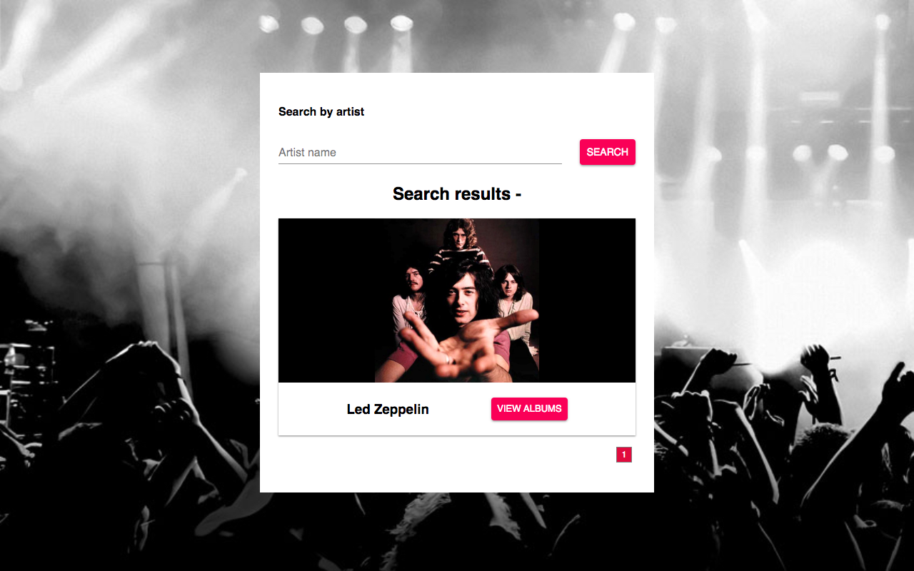
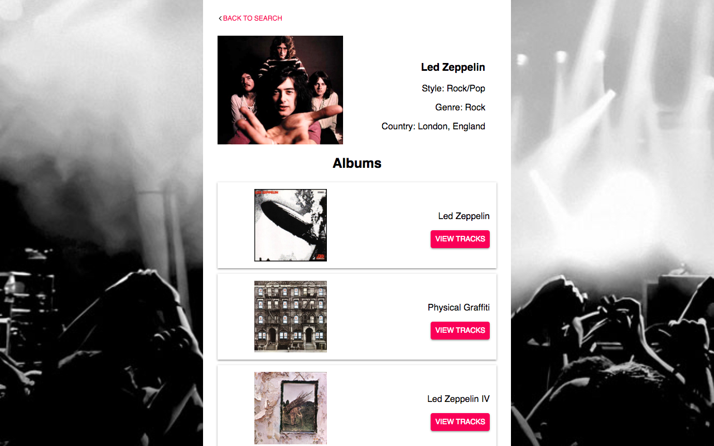
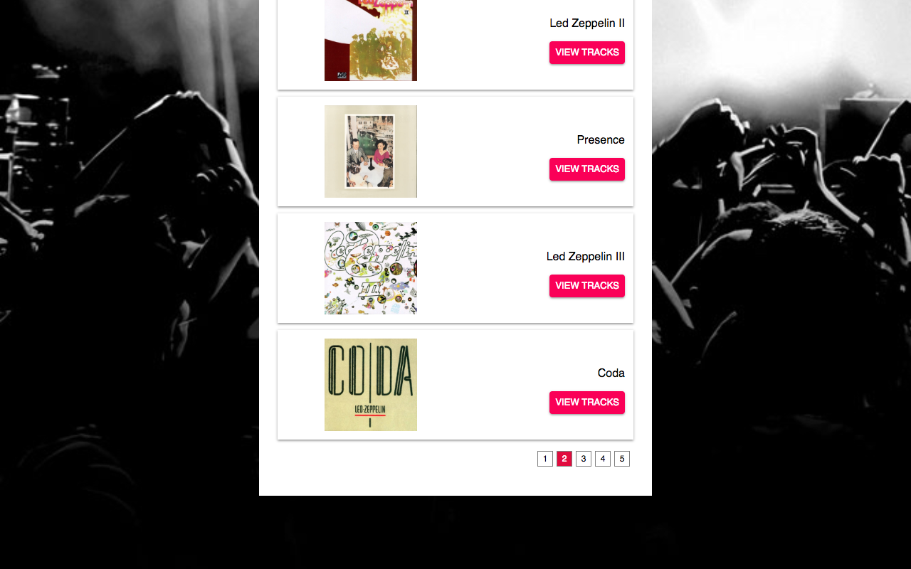
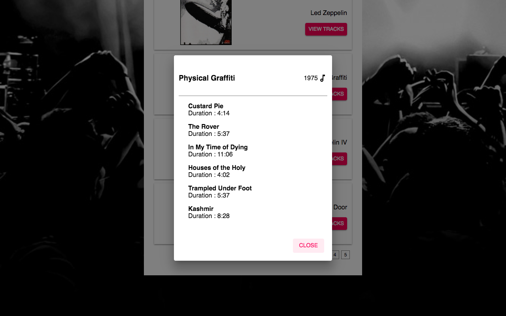

[**audioDB-react-app**](https://github.com/RisingStar-Web/audioDB-react-app)
-
This is small and simple mobile responsive artist search app developed in ReactJS using the [audiodb APIs](https://www.theaudiodb.com/api_guide.php)

The app has three screen:
  1) The first screen is a search page where you can search for an artist by name. There
  could be multiple artists that match the name, so pagination is added
  where the user can see the results page by page.
  2) Once you have found the artist you were searching for, click on the “View Albums”
  link will take you to an artist detail page where you will list (again, paginated) the
  albums of the artist.
  3) Clicking on the View Tracks of an album listing will open up a modal that shows the
  album name, the release date and a list of tracks in the album and the duration of
  each track.
This project was bootstrapped with [Create React App](https://github.com/facebookincubator/create-react-app).

Demo
-

-

-

-

-
The app can be seen in action [here](https://audiodb-artist-searchapp.surge.sh/).

**Run Locally**
-
 1.  Clone this repository and go into its src folder.
 2.  Run  `npm install`
 3.  Run  `npm start`
 4.  Go to  `http://localhost:3000`  to view the app
